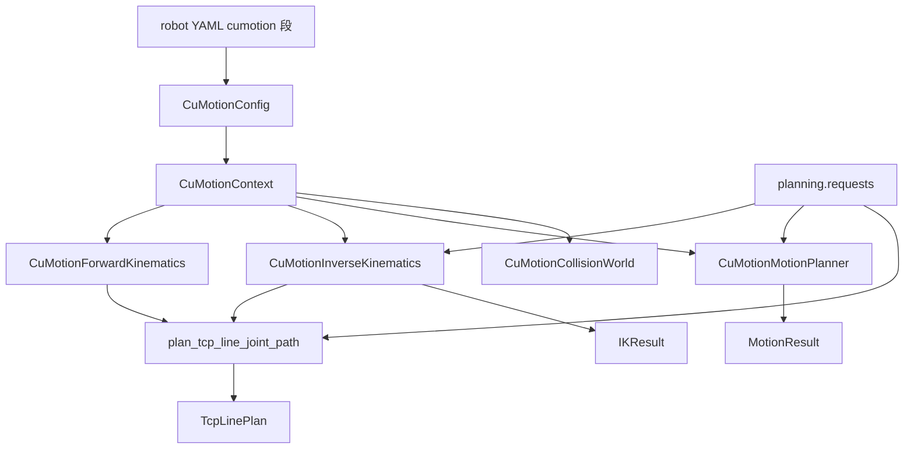
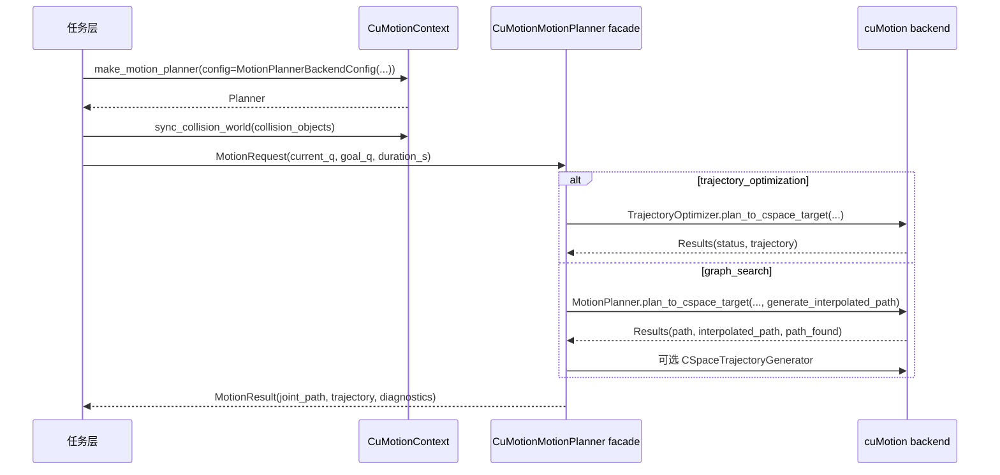
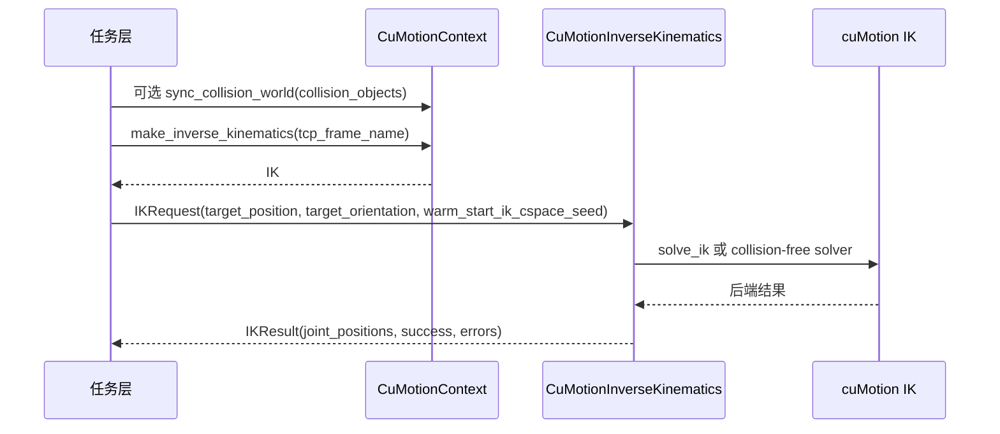

# cuMotion 后端接口说明

本文整理本项目中 `source/manipulation_project/backends/cumotion/` 对 cuMotion 的封装接口、数据流、坐标/关节顺序约定，以及任务层调用方式。

## 1. 总体边界

cuMotion 后端只处理 **机器人描述中的 C-space 主动关节**，不直接处理 Isaac articulation 的完整 DOF，也不直接处理 controller command space。

核心约定：

- 关节向量顺序：始终按 `CuMotionContext.joint_names()` 返回的 cuMotion C-space 顺序。
- 位置单位：米 `m`。
- 角度单位：弧度 `rad`。
- 姿态格式：项目边界使用 `wxyz` 四元数；调用 cuMotion 前在局部转换为旋转矩阵或 `Rotation3`。
- TCP/frame：必须存在于 cuMotion 加载的 URDF/XRDF 机器人描述中。自定义 TCP 需要先写入临时 URDF。
- 碰撞世界：由 `CuMotionContext` 持有当前 cuMotion `WorldView`；任务层可把 `CollisionObject` 环境快照同步到 context，但后端不自动从 Isaac stage 抽取。



## 2. 配置接口

### `CuMotionConfig`

位置：`source/manipulation_project/backends/cumotion/context.py`

用途：保存 cuMotion 后端需要的机器人描述文件、默认 frame 和 IK 参数。

主要字段：

| 字段 | 类型 | 含义 |
|---|---|---|
| `xrdf_path` | `str \| Path` | cuMotion XRDF 路径，描述 C-space、默认关节和语义配置 |
| `urdf_path` | `str \| Path` | cuMotion URDF 路径，描述机器人 link/joint |
| `flange_frame` | `str` | 机械臂法兰 link/frame；没有自定义 TCP 时作为默认末端 frame |
| `custom_tcp_frame` | `str \| None` | 可选自定义 TCP frame；通常由临时 URDF 或工具 URDF 显式加入 |
| `ik_cspace_seeds` | `np.ndarray \| None` | IK 默认 seed，按 cuMotion C-space 顺序，写入 cuMotion `IkConfig.cspace_seeds` |
| `position_tolerance` | `float` | IK 位置容差，单位 m |
| `orientation_tolerance` | `float` | IK 姿态容差，单位 rad |
| `ccd_max_iterations` | `int` | CCD IK 最大迭代次数 |
| `bfgs_max_iterations` | `int` | BFGS IK 最大迭代次数 |
| `orientation_weight` | `float` | IK 姿态误差权重 |
| `collision_free_ik_params` | `dict[str, Any]` | 传给 `CollisionFreeIkSolverConfig.set_param(...)` 的参数覆盖 |
| `motion_planner` | `MotionPlannerBackendConfig \| None` | motion planner facade 的分组配置；默认 pipeline 为 `trajectory_optimization` |
| `motion_planner_config_path` | `str \| Path \| None` | graph planner 配置文件路径；作为 `motion_planner.graph_search` 的默认值来源 |
| `motion_planner_params` | `dict[str, Any]` | graph planner 参数；作为 `motion_planner.graph_search.motion_planner_params` 的默认值来源 |
| `trajectory_limits` | `dict[str, np.ndarray]` | trajectory generation limits；作为 `motion_planner.trajectory_generation.limits` 的默认值来源 |
| `trajectory_solver_params` | `dict[str, Any]` | trajectory generation solver 参数；作为 `motion_planner.trajectory_generation.solver_params` 的默认值来源 |

构造入口：

- `CuMotionConfig.from_mapping(data)`
  - 支持直接传 `cumotion` 子字典，也支持传完整 robot YAML 字典。
  - 路径会通过 `repo_path(...)` 按仓库根目录解析。
  - 必填字段：`xrdf_path`、`urdf_path`、`flange_frame`。

示例配置：

```yaml
cumotion:
  xrdf_path: assets/single_system/arm/AR5V2_L/AR5V2_L.xrdf
  urdf_path: assets/single_system/arm/AR5V2_L/AR5V2_L.urdf
  flange_frame: AR5V2_L_arm_flan_link
  position_tolerance: 0.001
  orientation_tolerance: 0.1
  ccd_max_iterations: 180
  bfgs_max_iterations: 80
  orientation_weight: 0.25
  motion_planner:
    planning_pipeline: trajectory_optimization
    graph_search:
      generate_interpolated_path: true
      motion_planner_params: {}
    trajectory_generation:
      enabled: true
      mode: time_optimal
      limits:
        velocity: [1.0, 1.0, 1.0, 1.0, 1.0, 1.0]
```

### `CuMotionContext`

位置：`source/manipulation_project/backends/cumotion/context.py`

用途：进入真实 cuMotion 后端的共享上下文。负责延迟导入 `cumotion`、加载 XRDF/URDF，缓存 `robot_description` / `kinematics`，并维护当前环境的 `CuMotionCollisionWorld`。

主要属性：

| 属性 | 含义 |
|---|---|
| `cumotion` | 导入后的 cuMotion Python 模块 |
| `config` | `CuMotionConfig` |
| `robot_description` | `cumotion.load_robot_from_file(...)` 返回的机器人描述 |
| `kinematics` | `robot_description.kinematics()` |
| `expected_cspace_width` | cuMotion C-space 主动关节数量，用于 seed/path 宽度校验 |

主要方法：

| 方法 | 返回 | 含义 |
|---|---|---|
| `joint_names()` | `list[str]` | cuMotion C-space 主动关节名 |
| `frame_names()` | `list[str]` | cuMotion 可查询 frame 名 |
| `has_frame(frame_name)` | `bool` | 检查 frame 是否存在 |
| `collision_world()` | `CuMotionCollisionWorld` | 返回 context 当前环境；未设置时创建空环境 |
| `sync_collision_world(collision_objects)` | `CuMotionCollisionWorld` | 用环境快照按名称增量同步当前 world |
| `clear_collision_world()` | `CuMotionCollisionWorld` | 清空 context 当前环境 |
| `empty_collision_world()` | `CuMotionCollisionWorld` | 返回 context 复用的空 world，供几何/忽略障碍模式使用 |
| `make_inverse_kinematics(tcp_frame_name=None)` | `CuMotionInverseKinematics` | 创建 IK 封装 |
| `make_forward_kinematics()` | `CuMotionForwardKinematics` | 创建 FK 封装 |
| `make_motion_planner(...)` | `CuMotionMotionPlanner` | 创建路径级规划器 |

`make_motion_planner(...)` 参数：

| 参数 | 默认值 | 含义 |
|---|---:|---|
| `tcp_frame_name` | `None` | 任务空间目标使用的 TCP frame |
| `config` | `None` | `MotionPlannerBackendConfig`；为空时使用 `CuMotionConfig.motion_planner` 或默认配置 |

## 3. 正运动学 FK 接口

### `CuMotionForwardKinematics`

位置：`source/manipulation_project/backends/cumotion/forward_kinematics.py`

用途：封装 cuMotion `kinematics.pose(...)`，把后端 pose 归一化成项目格式。

主要方法：

| 方法 | 输入 | 输出 | 含义 |
|---|---|---|---|
| `joint_names()` | - | `list[str]` | 返回 C-space 关节名 |
| `frame_names()` | - | `list[str]` | 返回 frame 名 |
| `compute_cumotion_pose(joint_positions, frame_name)` | C-space 关节向量、frame 名 | cuMotion `Pose3` | 原始后端 pose |
| `compute_pose(joint_positions, frame_name)` | C-space 关节向量、frame 名 | `ForwardKinematicsPose` | 项目格式 pose |
| `compute_position(joint_positions, frame_name)` | C-space 关节向量、frame 名 | `np.ndarray(3,)` | 只返回位置 |
| `compute_orientation(joint_positions, frame_name)` | C-space 关节向量、frame 名 | `np.ndarray(4,)` | 返回 `wxyz` 四元数 |

### `ForwardKinematicsPose`

| 字段 | shape | 含义 |
|---|---|---|
| `position` | `(3,)` | frame 在机器人 base 下的位置 |
| `orientation` | `(4,)` | frame 姿态，`wxyz` 四元数 |
| `rotation_matrix` | `(3, 3)` | frame 姿态旋转矩阵 |

## 4. 逆运动学 IK 接口

### `CuMotionInverseKinematics`

位置：`source/manipulation_project/backends/cumotion/inverse_kinematics.py`

用途：把项目 `IKRequest` 转换成 cuMotion 几何 IK 或 collision-free IK 调用，并返回 `IKResult`。

创建：

```python
ik = context.make_inverse_kinematics(tcp_frame_name="pinch_tcp")
```

主要方法：

| 方法 | 输入 | 输出 | 含义 |
|---|---|---|---|
| `joint_names()` | - | `list[str]` | IK C-space 关节名 |
| `frame_names()` | - | `list[str]` | 可查询 frame 名 |
| `solve(request)` | `IKRequest` | `IKResult` | 求解单个 TCP 目标 |

`solve(...)` 分支：

- `request.avoid_collisions == False`
  - 调用几何 IK：`cumotion.solve_ik(...)`。
- `request.avoid_collisions == True`
  - 使用 `CuMotionContext` 当前管理的 `WorldView`。
  - 应用 `collision_free_ik_params`。
  - 用 `position_tolerance` / `orientation_tolerance` 构造 cuMotion 约束。
  - 调用 collision-free IK solver，并用 FK 复算位置/姿态误差。

进入后端前会校验目标 shape、warm start 非空、容差非负、TCP frame 非空；进入具体
`CuMotionContext` 后再校验 frame 是否存在以及 warm start 长度是否等于 C-space 维度。

### `IKRequest`

位置：`source/manipulation_project/planning/requests.py`

| 字段 | 含义 |
|---|---|
| `target_position` | TCP 目标位置，shape `(3,)`，单位 m |
| `target_orientation` | TCP 目标姿态，`wxyz`；为 `None` 时只约束位置 |
| `tcp_frame_name` | 目标 TCP frame；为空时使用 IK 实例默认 frame |
| `warm_start_ik_cspace_seed` | 上一帧 IK 关节解或初始 seed，按 C-space 顺序 |
| `position_tolerance` | 位置容差 |
| `orientation_tolerance` | 姿态容差 |
| `avoid_collisions` | 是否使用 collision-free IK |

### `IKResult`

位置：`source/manipulation_project/planning/results.py`

| 字段 | 含义 |
|---|---|
| `joint_positions` | IK 解，按 cuMotion C-space 顺序 |
| `success` | 是否成功 |
| `position_error` | 位置误差，单位 m |
| `orientation_error` | 姿态误差；无姿态目标或失败时为 `None` |
| `status` | 后端状态字符串 |
| `num_solutions` | 解数量 |

连续轨迹注意事项：

- `CuMotionInverseKinematics` 会在几何 IK 成功后把解写回后端 `IkConfig.cspace_seeds`。
- 对 waypoint 序列，调用方也应把上一点 `joint_positions` 作为下一点 `warm_start_ik_cspace_seed`，保证解分支连续。
- 如果请求、上一帧成功解和 `ik_cspace_seeds` 都没有提供 seed，则不在项目侧构造 fallback；未提供 seed 时使用 cuMotion 默认初始化逻辑。

## 5. 路径级 Motion Planner 接口

### `CuMotionMotionPlanner`

位置：`source/manipulation_project/backends/cumotion/motion_planner.py`

用途：统一封装三条 cuMotion 运动生成 pipeline：`trajectory_optimization`、`graph_search` 和
`specified_path`。facade 根据 `MotionPlannerBackendConfig.planning_pipeline` 分发，并统一返回
`MotionResult`。

创建：

```python
planner = context.make_motion_planner(
    tcp_frame_name="pinch_tcp",
    config=MotionPlannerBackendConfig(
        planning_pipeline="graph_search",
        graph_search=GraphSearchConfig(
            generate_interpolated_path=True,
            motion_planner_params={"step_size": 0.05},
        ),
        trajectory_generation=TrajectoryGenerationConfig(
            mode="time_stamped",
            interpolation_mode="cubic_spline",
            limits={"velocity": [1.0] * 6},
            solver_params={"max_iterations": 200},
        ),
    ),
)
```

主要方法：

| 方法 | 输入 | 输出 | 含义 |
|---|---|---|---|
| `joint_names()` | - | `list[str]` | planner C-space 关节名 |
| `plan(request)` | `MotionRequest \| SpecifiedPathRequest` | `MotionResult` | 按配置 pipeline 规划 |

Pipeline：

| Pipeline | 请求类型 | cuMotion 能力 | 默认碰撞语义 |
|---|---|---|---|
| `trajectory_optimization` | `MotionRequest` | `TrajectoryOptimizer` | 使用当前环境障碍 |
| `graph_search` | `MotionRequest` | `MotionPlanner` + `CSpaceTrajectoryGenerator` | 使用当前环境障碍 |
| `specified_path` | `SpecifiedPathRequest` | C-space waypoints + `CSpaceTrajectoryGenerator` | 不做避障搜索 |

`MotionRequest` 目标类型：

| 请求字段 | cuMotion 调用 | 含义 |
|---|---|---|
| `goal_q` | optimizer 或 graph planner 的 C-space target | 规划到目标 C-space 构型 |
| `goal_pose.position` 且无 orientation | optimizer task-space target 或 graph translation target | 规划到 TCP 位置目标 |
| `goal_pose.position + orientation` | optimizer task-space target 或 graph pose target | 规划到 TCP 位姿目标 |

路径与轨迹：

- `trajectory_optimization`
  - 直接返回 cuMotion `Trajectory`。
  - 默认 `MotionResult.joint_path=None`，`trajectory` 是主输出。
  - 失败时直接返回 optimizer 的失败结果；需要其它路线时由任务层显式选择 `graph_search` 或重新发起请求。
- `graph_search.generate_interpolated_path=True`
  - 优先消费 cuMotion `interpolated_path`。
  - 若后端未返回，则回退到 sparse `path`。
- `graph_search.generate_interpolated_path=False`
  - 只消费 sparse `path`。
- `trajectory_generation.enabled=True`
  - 对 graph_search 或 specified_path 产生的 `joint_path` 做时间参数化。
  - 若配置了 `trajectory_generation.limits`，会设置 position/velocity/acceleration/jerk 限制。
  - 若配置了 `trajectory_generation.solver_params`，会调用 `set_solver_param(...)`。
- `trajectory_generation.mode="time_optimal"`
  - 调用 `generator.generate_trajectory(waypoints)`。
- `trajectory_generation.mode="time_stamped"`
  - 需要 `MotionRequest.duration_s`。
  - 按 C-space 路径段长度给 waypoint 分配 `[0, duration_s]` 时间戳。
  - 调用 `generator.generate_time_stamped_trajectory(...)`。

### `MotionRequest`

位置：`source/manipulation_project/planning/requests.py`

| 字段 | 含义 |
|---|---|
| `current_q` | 当前 C-space 关节向量，必填 |
| `goal_q` | 目标 C-space 关节向量；和 `goal_pose` 二选一 |
| `goal_pose` | TCP 目标；和 `goal_q` 二选一 |
| `tcp_frame_name` | 任务空间目标使用的 TCP frame |
| `duration_s` | `trajectory_generation.mode='time_stamped'` 时的阶段时长 |

碰撞语义：

- `MotionRequest` 只描述目标，不携带碰撞模式字段。
- `trajectory_optimization.use_environment_obstacles` 和 `graph_search.use_environment_obstacles` 控制是否使用当前环境。
- `specified_path` 默认不把环境障碍作为规划约束；如需安全性，应做后验碰撞检查或任务层保证路径安全。

注意：不使用环境障碍只是不读取 context 当前环境；机器人自身碰撞和关节限制仍由 cuMotion robot description / 后端 config 决定。该分支不会清空 `CuMotionContext.collision_world()` 中已经同步好的环境。

### `SpecifiedPathRequest`

位置：`source/manipulation_project/planning/requests.py`

支持的路径输入：

| 字段 | 含义 |
|---|---|
| `current_q` | 当前 C-space 关节向量，必填 |
| `path=CSpaceWaypointPath(...)` | 至少两个 C-space waypoint，全部按 cuMotion C-space 顺序 |
| `tcp_frame_name` | task-space path 使用的 TCP frame；C-space waypoints 不读取该字段 |
| `duration_s` | `trajectory_generation.mode='time_stamped'` 时的阶段时长 |

`TaskSpacePath` 和 `CompositePath` 在当前 facade 中会抛出明确 `NotImplementedError`；TCP 直线移动使用 `tcp_line.py` / `MoveTcpLineConfig` 辅助路径。

### `MotionResult`

位置：`source/manipulation_project/planning/results.py`

| 字段 | 含义 |
|---|---|
| `joint_path` | 离散 C-space 关节路径，shape `(N, dof)`；失败时为 `None` |
| `trajectory` | cuMotion trajectory 对象；未生成或失败时为 `None` |
| `success` | 是否成功 |
| `status` | `SUCCESS` 或 `FAILED` |
| `diagnostics` | `PlanningDiagnostics`，包含 waypoint 数、碰撞对象数、路径长度等 |

## 6. 碰撞世界接口

### `CuMotionCollisionWorld`

位置：`source/manipulation_project/backends/cumotion/collision_world.py`

用途：把项目 `CollisionObject` 转换成 cuMotion `World` obstacle，并创建/维护 `world_view`。通常由 `CuMotionContext.sync_collision_world(...)` 持有和复用。

创建：

```python
collision_world = context.sync_collision_world(collision_objects)
```

主要属性：

| 属性 | 含义 |
|---|---|
| `world` | cuMotion `World` |
| `world_view` | `world.add_world_view()` 后的静态快照 |
| `handles` | 以对象名索引的 obstacle handle 字典 |
| `obstacles` | 以对象名索引的 obstacle 对象字典 |

主要方法：

| 方法 | 含义 |
|---|---|
| `add(obj)` | 添加 enabled obstacle，返回 obstacle handle |
| `set_pose(name, pose_matrix)` | 更新已添加 obstacle 的 pose |
| `enable(name)` / `disable(name)` | 开关已添加 obstacle |
| `remove(name)` | 删除 obstacle，并清理本地 handle |
| `sync(collision_objects)` | 按名称增量同步：新增、删除、启停、pose 更新；几何变化时重建 |
| `update()` | 调用 `world_view.update()` 刷新静态视图 |
| `make_world_inspector()` | 创建 `CuMotionWorldInspector` |
| `make_robot_world_inspector()` | 创建 `CuMotionRobotWorldInspector` |

支持形状：

| 项目 shape | cuMotion obstacle type | 尺寸解释 |
|---|---|---|
| `cuboid` | `CUBOID` | `SIDE_LENGTHS = padded_size().reshape(3)` |
| `sphere` | `SPHERE` | `RADIUS = padded_size()[0]` |
| `capsule` | `CAPSULE` | `RADIUS = padded_size()[0]`, `HEIGHT = padded_size()[1]` |

约定：

- `CollisionObject.enabled == False` 时不会加入后端 world。
- 位姿通过 `obj.pose_matrix()` 转换为 cuMotion `Pose3`。
- 构造后立即 `world_view.update()`。
- `context.empty_collision_world()` 返回的空 world 与当前环境分离并在 context 内复用，适合几何规划或临时忽略障碍；调用方不应向它添加 obstacle。

### `CuMotionWorldInspector` / `CuMotionRobotWorldInspector`

位置：`source/manipulation_project/backends/cumotion/collision_world.py`

用途：轻量封装官方 `WorldInspector` 和 `RobotWorldInspector`，用于调试障碍物状态、点/球距离、
机器人自碰和机器人与 world 障碍物碰撞。

当前封装的典型方法：

| 封装 | 方法 |
|---|---|
| `CuMotionWorldInspector` | `num_enabled_obstacles()`、`is_enabled(...)`、`pose(...)`、`in_collision(...)`、`min_distance(...)`、`distance_to(...)`、`distances_to(...)` |
| `CuMotionRobotWorldInspector` | `in_self_collision(...)`、`frames_in_self_collision(...)`、`in_collision_with_obstacle(...)`、`min_distance_to_obstacle(...)`、`distance_to_obstacle(...)`、collision sphere 数量/位置/半径/frame 查询 |

## 7. 姿态适配接口

位置：`source/manipulation_project/backends/cumotion/pose_adapter.py`

| 函数 | 输入 | 输出 | 含义 |
|---|---|---|---|
| `pose_from_position_quat_wxyz(cumotion, position, orientation=None)` | 位置和可选 `wxyz` 四元数 | cuMotion `Pose3` | 构造任务空间目标 pose；无姿态时只约束平移 |
| `rotation_from_quat_wxyz(cumotion, quaternion)` | `wxyz` 四元数 | cuMotion `Rotation3` | 直接从项目标准四元数构造 cuMotion 旋转 |
| `pose_from_matrix(cumotion, matrix)` | `4x4` 齐次矩阵 | cuMotion `Pose3` | 构造碰撞物体 pose |

注意：项目边界用 `wxyz`。任务空间目标直接用 `Rotation3(w, x, y, z)` 构造；碰撞物体的
齐次矩阵 pose 仍用 `Rotation3.from_matrix(...)` 构造。

## 8. 轨迹适配接口

### `joint_trajectory_from_cumotion(...)`

位置：`source/manipulation_project/backends/cumotion/trajectory_adapter.py`

用途：采样 cuMotion trajectory，并转换成项目 `JointTrajectory`。

函数签名语义：

| 参数 | 含义 |
|---|---|
| `trajectory` | cuMotion trajectory 对象 |
| `joint_names` | 输出轨迹列名，通常为 cuMotion C-space 关节名 |
| `sample_dt` | 按固定周期采样；和 `times` 二选一 |
| `times` | 显式采样时刻；和 `sample_dt` 二选一 |
| `phase` | 写入 `JointTrajectory.phases` 的阶段名 |

读取的 cuMotion 接口：

- `trajectory.domain()`：返回时间域，可为带 `lower/upper` 属性的对象或 tuple。
- `trajectory.eval_all(t)`：返回 position、velocity、acceleration、jerk。

输出：

- `JointTrajectory`
  - `times`
  - `positions`
  - `velocities`
  - `accelerations`
  - `jerks`
  - `phases`
  - `joint_names`

## 9. TCP 直线 IK 辅助接口

### `plan_tcp_line_joint_path(...)`

位置：`source/manipulation_project/backends/cumotion/tcp_line.py`

用途：在后端 C-space 中生成一条 TCP 直线对应的关节路径。

流程：

1. 校验 `TcpLineRequest`。
2. 读取 `context.joint_names()`，检查当前关节向量长度。
3. 用 FK 计算当前 TCP pose。
4. 根据 `target_position` 或 `target_offset` 采样任务空间直线。
5. 对每个 waypoint 调用 IK。
6. 每个成功 IK 解作为下一点 warm start。
7. 返回 `TcpLinePlan`。

输入上下文协议：`TcpLineKinematicsContext`

| 方法 | 含义 |
|---|---|
| `joint_names()` | 返回后端关节顺序 |
| `make_forward_kinematics()` | 返回 FK 对象 |
| `make_inverse_kinematics(tcp_frame_name=None)` | 返回 IK 对象 |

### `TcpLineRequest`

位置：`source/manipulation_project/planning/requests.py`

| 字段 | 含义 |
|---|---|
| `tcp_frame_name` | 要沿直线移动的 TCP frame |
| `current_joint_positions` | 当前 C-space 关节位置 |
| `start_position` | 直线起点；为 `None` 时使用当前 FK 位置 |
| `target_position` | 绝对终点；和 `target_offset` 二选一 |
| `target_offset` | 相对起点位移；和 `target_position` 二选一 |
| `orientation_mode` | `current`、`target` 或 `none` |
| `target_orientation` | 目标姿态 `wxyz` |
| `target_rpy` | 目标姿态 RPY，`orientation_mode='target'` 时可用 |
| `duration_s` | 直线阶段时长 |
| `sample_hz` | waypoint 采样频率 |
| `position_tolerance` | IK 位置容差 |
| `orientation_tolerance` | IK 姿态容差 |

### `TcpLinePlan`

| 字段 | 含义 |
|---|---|
| `times` | waypoint 时间戳 |
| `joint_positions` | 每个 waypoint 的 C-space 关节解 |
| `diagnostics` | 起终点、姿态端点、关节名、最大位置误差 |

## 10. 自定义 TCP URDF 接口

### `write_tcp_urdf(...)`

位置：`source/manipulation_project/backends/cumotion/tcp_urdf_builder.py`

用途：复制基础 URDF，并在指定 parent frame 下追加一个 fixed TCP link/joint。cuMotion 只能对 URDF 中已有 link 求解，因此 pinch TCP 等自定义 TCP 必须先写入 URDF。

参数：

| 参数 | 含义 |
|---|---|
| `urdf_path` | 基础 URDF 路径 |
| `output_urdf_path` | 输出临时 URDF 路径 |
| `tcp` | `TcpFrame`，包含 `parent_frame`、`frame_name`、`xyz`、`rpy` |

行为：

- 检查 `tcp.parent_frame` 是否存在。
- 检查 `tcp.frame_name` 是否已存在。
- 添加：
  - `<link name="tcp.frame_name" />`
  - fixed joint：`parent=tcp.parent_frame`，`child=tcp.frame_name`
  - origin：`xyz` 单位 m，`rpy` 单位 rad
- 返回输出 `Path`。

## 11. 任务层典型数据流

### 关节目标到关节目标



### TCP 位姿目标 IK



### 完整 articulation DOF 映射

cuMotion 输出只覆盖 C-space 主动关节。若机器人是“机械臂 + 灵巧手”的组合 articulation，任务层必须按名称映射：

1. 从完整 DOF 名称中找到 cuMotion `joint_names()` 对应索引。
2. 调用 cuMotion 前，从完整 DOF 裁剪出 C-space 子向量。
3. cuMotion 返回 `joint_path` 或 `joint_positions` 后，再按名称写回完整 DOF 轨迹。
4. 手部、mimic follower 或其它非 cuMotion DOF 由任务层单独插值或控制。

## 12. 常见注意事项

- 不要假设 cuMotion C-space 顺序等于 Isaac articulation DOF 顺序；必须用关节名对齐。
- `MotionRequest.goal_q` 和 `current_q` 必须长度一致，并且都使用 C-space 顺序。
- `IKRequest.target_orientation=None` 表示只约束位置；IK 封装会放宽姿态容差并把姿态权重置 0。
- `trajectory_generation.mode='time_stamped'` 时必须传 `duration_s`，且必须为正数。
- `graph_search.generate_interpolated_path=True` 只影响 graph pipeline 最终优先使用哪条离散路径。
- 是否使用环境障碍由 pipeline 分组配置决定；`MotionRequest` 只描述目标。
- 自定义 TCP 必须先写入 URDF，否则 cuMotion 无法对该 frame 做 FK/IK/规划。
- `CollisionObject.enabled=False` 的障碍物会被跳过。
- 失败的 `MotionResult` 中 `joint_path` 会是 `None`，调用方应先检查 `success`。

## 13. cuMotion 官方 Python API 接口总览

本节按当前环境中的 `cumotion/_cumotion.pyi`（`cumotion.__version__ == 1.1.0`）和官方 Python API 文档整理 cuMotion 暴露的接口，并标注本项目是否已经接入。

官方来源：[NVIDIA cuMotion Python API](https://nvidia-isaac.github.io/cumotion/api/python_api.html)。

状态说明：

- **已接入**：本项目已有直接封装或任务层实际调用。
- **部分接入**：本项目只使用该类/函数的一部分能力。
- **未接入**：cuMotion Python API 存在，但本项目当前没有封装入口。
- **辅助/底层**：主要作为其它接口的参数、返回值或枚举使用。

表格中的“功能说明”按项目使用视角解释：它回答“这个接口负责什么、输入输出大概是什么、通常放在哪条运动规划数据流里”。官方 API 中部分 pybind overload 在 HTML 中显示为 `*args, **kwargs`，这里按本地 `_cumotion.pyi` 和实际用途归纳。

### 13.1 模块级函数

| 接口 | 状态 | 功能说明 |
|---|---|---|
| `load_robot_from_file(robot_xrdf, robot_urdf)` | 已接入 | 从 XRDF 读取 C-space、碰撞球、默认配置等 cuMotion 语义信息，从 URDF 读取 link/joint 运动树，返回 `RobotDescription`。这是进入 cuMotion 后端的模型加载入口。 |
| `load_robot_from_memory(robot_xrdf, robot_urdf)` | 未接入 | 与 `load_robot_from_file(...)` 等价，但输入是 XRDF/URDF 文本字符串，适合运行时生成或网络加载机器人描述。 |
| `solve_ik(kinematics, target_pose, target_frame, config)` | 已接入 | 执行不显式考虑碰撞的几何 IK：给定 `Kinematics`、目标 `Pose3`、目标 frame 和 `IkConfig`，返回单个 `IkResults`。适合快速求一个 TCP 位姿解。 |
| `create_world()` | 已接入 | 创建可变的碰撞世界容器 `World`。障碍物先加到 `World`，再通过 `add_world_view()` 生成 solver/planner 可用的静态视图。 |
| `create_obstacle(type)` | 已接入 | 按 `Obstacle.Type` 创建一个障碍物壳对象；随后必须通过 `set_attribute(...)` 填半径、边长、高度或 SDF grid。 |
| `create_world_inspector(world_view)` | 已接入 | 创建只读世界距离/碰撞查询器，可查询点或球到障碍物的距离、是否碰撞、最小距离和 obstacle pose。用于调试 world 本身。 |
| `create_robot_world_inspector(robot_description, world_view=None)` | 已接入 | 创建机器人碰撞球检查器，可检查自碰、机器人与 world 障碍物碰撞、最小距离和每个碰撞球位置。适合规划请求诊断。 |
| `create_default_collision_free_ik_solver_config(robot_description, tool_frame_name, world_view)` | 已接入 | 基于机器人、工具 frame 和 world view 生成 collision-free IK 默认配置，包含碰撞模型和求解器默认参数。 |
| `create_collision_free_ik_solver(config)` | 已接入 | 根据 `CollisionFreeIkSolverConfig` 创建 collision-free IK 求解器，用 `TaskSpaceTarget` + seed 求无碰撞 C-space 解。 |
| `create_default_motion_planner_config(robot_description, tool_frame_name, world_view)` | 已接入 | 生成 graph-based `MotionPlanner` 的默认配置，把机器人、工具 frame 和 world view 绑定到 planner。 |
| `create_motion_planner(config)` | 已接入 | 根据 `MotionPlannerConfig` 创建全局路径规划器，支持 C-space、translation、pose 三类目标。 |
| `create_motion_planner_config_from_file(config_file, robot_description, tool_frame_name, world_view)` | 已接入 | 从配置文件读取 graph planner 参数，再绑定机器人、工具 frame 和 world view。适合调 `step_size`、采样策略、迭代预算等 planner 细项。 |
| `create_cspace_trajectory_generator(num_cspace_coords)` | 未接入 | 按自由度数量创建 C-space 轨迹生成器，不自动继承机器人限位。需要调用方手动设置位置/速度/加速度/jerk limits。 |
| `create_cspace_trajectory_generator(kinematics)` | 已接入 | 从 `Kinematics` 创建 C-space 轨迹生成器，通常会继承机器人 C-space 维度和约束，用于给 waypoint path 做时间参数化。 |
| `create_default_trajectory_optimizer_config(robot_description, tool_frame_name, world_view)` | 未接入 | 生成 trajectory optimizer 默认配置，用于直接优化 collision-free trajectory，而不是先 graph 搜索再后处理。 |
| `create_trajectory_optimizer(config)` | 未接入 | 创建 trajectory optimization 求解器，可直接规划到 C-space target、task-space target 或 goalset，并返回 `Trajectory`。 |
| `create_trajectory_optimizer_config_from_file(config_file, robot_description, tool_frame_name, world_view)` | 未接入 | 从文件读取 trajectory optimizer 参数，适合调优化权重、约束和收敛行为。 |
| `create_cspace_path_spec(initial_cspace_position)` | 未接入 | 创建程序化 C-space 路径规格，后续通过 `add_cspace_waypoint(...)` 追加关节空间 waypoint。 |
| `create_task_space_path_spec(initial_pose)` | 未接入 | 创建程序化 task-space 路径规格，后续可追加直线、平移、旋转、圆弧等 TCP 路径段。 |
| `create_composite_path_spec(initial_cspace_position)` | 未接入 | 创建混合路径规格，可以把 C-space path spec 和 task-space path spec 拼成一条复合路径。 |
| `create_linear_cspace_path(cspace_path_spec)` | 未接入 | 把 `CSpacePathSpec` 转成可连续求值的 `LinearCSpacePath`，可按路径参数 `s` 采样关节位置。 |
| `convert_task_space_path_spec_to_cspace(task_space_path_spec, kinematics, control_frame, ...)` | 未接入 | 用 IK/path conversion 把 task-space TCP 路径离散/转换为 C-space path。可替代当前自写 TCP 直线逐点 IK 的一部分。 |
| `convert_composite_path_spec_to_cspace(composite_path_spec, kinematics, control_frame, ...)` | 未接入 | 把混合 C-space/task-space 规格转换成统一的 C-space path，适合多段任务路径。 |
| `load_cspace_path_spec_from_file(path)` | 未接入 | 从 YAML 文件读取 C-space path spec，适合把离线路径规格写成配置。 |
| `load_cspace_path_spec_from_memory(yaml)` | 未接入 | 从 YAML 字符串读取 C-space path spec。 |
| `load_task_space_path_spec_from_file(path)` | 未接入 | 从 YAML 文件读取 task-space path spec。 |
| `load_task_space_path_spec_from_memory(yaml)` | 未接入 | 从 YAML 字符串读取 task-space path spec。 |
| `load_composite_path_spec_from_file(path)` | 未接入 | 从 YAML 文件读取 composite path spec。 |
| `load_composite_path_spec_from_memory(yaml)` | 未接入 | 从 YAML 字符串读取 composite path spec。 |
| `export_cspace_path_spec_to_memory(cspace_path_spec)` | 未接入 | 把程序化构造的 C-space path spec 导出成 YAML 字符串，便于调试或持久化。 |
| `export_task_space_path_spec_to_memory(task_space_path_spec)` | 未接入 | 把 task-space path spec 导出成 YAML 字符串。 |
| `export_composite_path_spec_to_memory(composite_path_spec)` | 未接入 | 把 composite path spec 导出成 YAML 字符串。 |
| `create_rmpflow_config_from_file(config_file, robot_description, world_view)` | 未接入 | 从文件创建 RMPflow 配置，绑定机器人和 world view，用于 reactive motion policy。 |
| `create_rmpflow_config_from_file(config_file, robot_description, end_effector_frame, world_view)` | 未接入 | deprecated overload，额外传 end effector frame；官方已标记 deprecated。 |
| `create_rmpflow_config_from_memory(config_yaml, robot_description, world_view)` | 未接入 | 从 YAML 字符串创建 RMPflow 配置。 |
| `create_rmpflow_config_from_memory(config_yaml, robot_description, end_effector_frame, world_view)` | 未接入 | deprecated memory overload，额外传 end effector frame。 |
| `create_rmpflow(config)` | 未接入 | 根据 `RmpFlowConfig` 创建 reactive policy；运行时输入当前关节状态/速度，输出 C-space 加速度或力/metric。 |
| `create_collision_sphere_generator(vertices, triangles)` | 未接入 | 为一个 mesh 创建碰撞球生成器，后续可多次采样/生成 sphere set。 |
| `generate_collision_spheres(vertices, triangles, ...)` | 未接入 | 一次性从 mesh 顶点和三角面生成碰撞球，通常用于制作 XRDF 中的碰撞模型。 |
| `set_log_level(level)` | 未接入 | 设置 cuMotion 全局日志等级，控制内部求解器输出详细程度。 |
| `set_default_logger_prefix(prefix)` | 未接入 | 设置 cuMotion 默认 logger 前缀，方便把后端日志和项目日志区分开。 |
| `set_default_logger_text_style(log_level, style)` | 未接入 | 设置指定日志等级的文本样式，主要用于终端日志显示。 |

### 13.2 基础数学与日志类型

| 类型 | 状态 | 功能说明 | 主要接口功能 |
|---|---|---|---|
| `LogLevel` | 未接入 | 日志等级枚举，控制 cuMotion 内部日志输出粒度。 | `FATAL`/`ERROR`/`WARNING`/`INFO`/`VERBOSE` 从少到多输出不同严重级别日志。 |
| `Rotation3` | 部分接入 | 表示三维旋转，内部可由四元数、旋转矩阵、轴角或 scaled axis 构造；用于 pose、姿态目标、姿态误差和旋转插值。 | `identity()` 生成单位旋转；`from_matrix()`/`from_axis_angle()`/`from_scaled_axis()` 从不同表示构造；`slerp()` 做球面插值；`distance()` 计算两个旋转的角距离；`inverse()` 求逆；`matrix()`/`scaled_axis()`/`w()`/`x()`/`y()`/`z()` 导出表示；乘法用于旋转组合。 |
| `Pose3` | 已接入 | 表示三维刚体位姿，即 `Rotation3 + translation`；用于 TCP 目标、FK 输出和障碍物 pose。 | `identity()` 生成单位位姿；`from_translation()` 生成只含平移的位姿；`from_rotation()` 生成只含旋转的位姿；构造函数可直接传旋转和平移；`inverse()` 求逆；`matrix()` 导出 4x4 矩阵；`rotation`/`translation` 读取组成部分；乘法用于 pose 组合或坐标变换。 |

本项目通过 `pose_adapter.py` 主要使用 `Rotation3(w, x, y, z)` 从项目标准 `wxyz` 四元数构造目标旋转，并使用 `Rotation3.from_matrix(...)` 从齐次矩阵构造障碍物 pose。

### 13.3 机器人描述与运动学

| 类型 | 状态 | 功能说明 | 主要接口功能 |
|---|---|---|---|
| `RobotDescription` | 已接入 | 机器人模型的高层描述，来自 XRDF/URDF。它不是求解器本身，而是创建 FK/IK/planner/optimizer 配置的共同模型来源。 | `num_cspace_coords()` 返回 C-space 维度；`cspace_coord_name(i)` 返回第 i 个主动关节名；`default_cspace_configuration()` 返回默认关节构型；`tool_frame_names()` 返回 XRDF 声明的工具 frame；`kinematics()` 返回可做 FK/Jacobian/limit 查询的 `Kinematics`。 |
| `Kinematics` | 部分接入 | 机器人运动学查询对象，输入 C-space 关节位置，输出 frame 位姿、位置、姿态、Jacobian 和关节限制。 | `base_frame_name()` 返回 base frame；`num_cspace_coords()`/`cspace_coord_name(i)` 描述 C-space；`frame_names()` 列出可查询 frame；`pose(...)`/`position(...)`/`orientation(...)` 做 FK；`jacobian(...)`/`position_jacobian(...)`/`orientation_jacobian(...)` 求雅可比；`within_cspace_limits(...)` 检查关节限位；`cspace_coord_limits(i)`/`velocity_limit`/`acceleration_limit`/`jerk_limit` 查询每个关节约束。 |
| `Kinematics.Limits` | 辅助/底层 | 一个关节坐标的上下界容器。 | `lower` 是下界，`upper` 是上界。 |

本项目 FK 封装主要用 `kinematics.pose(...)`、`frame_names()` 和 C-space 关节名查询；`position(...)`、`orientation(...)`、Jacobian 与 limit 查询目前没有封装成项目接口。

### 13.4 几何 IK

| 类型 | 状态 | 功能说明 | 主要接口功能 |
|---|---|---|---|
| `IkConfig` | 部分接入 | 几何 IK 的参数集合，控制目标容差、seed、多次 descent、CCD/BFGS 迭代和目标误差权重。 | `position_tolerance`/`orientation_tolerance` 定义成功阈值；cuMotion 原生 `cspace_seeds` 提供一个或多个初值，项目配置字段为 `ik_cspace_seeds`；`ccd_max_iterations`/`bfgs_max_iterations` 控制两阶段迭代预算；`ccd_*_weight`/`bfgs_*_weight` 控制位置/姿态误差权重；`max_num_descents`/`sampling_seed`/`irwin_hall_sampling_order` 控制多 seed/采样行为；`*_termination*` 控制收敛；`bfgs_cspace_limit_*` 控制靠近关节限位时的 bias/penalty。 |
| `IkConfig.CSpaceLimitBiasing` | 未接入 | 控制 BFGS 阶段是否对 C-space 关节限位做 bias。 | `AUTO` 由 cuMotion 决定；`ENABLE` 强制启用；`DISABLE` 强制关闭。 |
| `IkResults` | 已接入 | 几何 IK 的单次结果对象，保存是否成功、解和误差。 | `success` 表示是否满足容差；`cspace_position` 是 C-space 解；`position_error` 是位置误差；`x/y/z_axis_orientation_error` 是姿态三轴误差；`num_descents` 是实际 descent 次数。 |

本项目当前暴露的 IK 参数集中在容差、seed、CCD/BFGS 迭代次数和 orientation weight，其它 `IkConfig` 细项仍未开放到 YAML。

### 13.5 Collision-free IK

| 类型 | 状态 | 功能说明 | 主要接口功能 |
|---|---|---|---|
| `CollisionFreeIkSolverConfig` | 部分接入 | collision-free IK 求解器配置，绑定机器人、工具 frame、world view 和 solver 参数。 | `set_param(param_name, ParamValue)` 修改底层优化参数，例如迭代预算、权重或距离阈值；具体参数名由 cuMotion 配置约定。 |
| `CollisionFreeIkSolverConfig.ParamValue` | 辅助/底层 | `set_param(...)` 使用的类型包装。 | 支持 `int` 和 `float`，用于把 Python 数值传给 pybind 配置对象。 |
| `CollisionFreeIkSolver` | 部分接入 | 显式考虑机器人碰撞/环境障碍的 IK 求解器，返回满足 task-space 约束且无碰撞的 C-space 解。 | `solve(...)` 解单个 target；`solve_array(...)` 一次解多个 problem/target；`solve_goalset(...)` 从多个可选目标中找可行解，官方标记为 deprecated goalset 接口。 |
| `CollisionFreeIkSolver.TranslationConstraint` | 部分接入 | 单目标平移约束，描述 TCP 应到达的世界/base 位置。 | `target(translation_target, deviation_limit=None)` 创建位置目标；`deviation_limit` 是允许偏差。当前实现会传入 `IKRequest.position_tolerance`。 |
| `CollisionFreeIkSolver.TranslationConstraintArray` | 未接入 | 多 problem、多 target 的平移约束容器。 | `target(...)` 从嵌套 translation target 列表创建；`num_constraints(problem_index)` 查询某个 problem 的目标数；`num_problems()` 查询 problem 数。 |
| `CollisionFreeIkSolver.TranslationConstraintGoalset` | 未接入 | goalset 版本平移约束，表示多个候选目标位置。 | `target(...)` 创建候选位置集合；官方已推荐用 array 接口替代。 |
| `CollisionFreeIkSolver.OrientationConstraint` | 部分接入 | 单目标姿态约束，描述 TCP 姿态是否不约束、完全对准目标、或只让某个轴对齐。 | `none()` 表示不约束姿态；`target(orientation_target, deviation_limit=None)` 完全约束旋转；`axis(tool_frame_axis, world_target_axis, axis_deviation_limit=None)` 只约束工具轴方向。当前实现未接入 `axis(...)`。 |
| `CollisionFreeIkSolver.OrientationConstraintArray` | 未接入 | 多 problem、多 target 的姿态约束容器。 | `none()` 创建全不约束；`target(...)` 创建完全姿态目标数组；`axis(...)` 创建轴对齐目标数组；`num_constraints(...)`/`num_problems()` 查询结构。 |
| `CollisionFreeIkSolver.OrientationConstraintGoalset` | 未接入 | goalset 版本姿态约束。 | `none()`/`target(...)`/`axis(...)` 创建候选姿态约束；官方已推荐用 array 接口替代。 |
| `CollisionFreeIkSolver.TaskSpaceTarget` | 已接入 | 单个 task-space IK 目标，由一个平移约束和一个姿态约束组成。 | 构造函数把 `TranslationConstraint` 和 `OrientationConstraint` 组合成 `solve(...)` 的输入。 |
| `CollisionFreeIkSolver.TaskSpaceTargetArray` | 未接入 | 多 problem、多 target 的 task-space 目标数组。 | 构造函数组合 translation/orientation constraint arrays；`num_problems()`/`num_targets(problem_index)` 查询目标结构。 |
| `CollisionFreeIkSolver.TaskSpaceTargetGoalset` | 未接入 | goalset 版本 task-space 目标。 | 构造函数组合 goalset translation/orientation constraints；官方已推荐用 array 接口替代。 |
| `CollisionFreeIkSolver.Results` | 已接入 | 单个 collision-free IK solve 的输出。 | `status()` 返回成功/失败枚举；`cspace_positions()` 返回一个或多个 C-space 解；`target_indices()` 返回命中的目标索引。 |
| `CollisionFreeIkSolver.Results.Status` | 辅助/底层 | collision-free IK 状态枚举。 | `SUCCESS` 表示找到解；`INVERSE_KINEMATICS_FAILURE` 表示未找到满足约束的解。 |
| `CollisionFreeIkSolver.ResultsArray` | 未接入 | `solve_array(...)` 的输出，每个 problem 有一个 `Results`。 | `num_problems()` 返回 problem 数；`num_successes()` 返回成功数量；`problem(index)` 取单个 problem 的结果。 |

本项目 collision-free IK 只使用单个 task-space target；数组、多目标 goalset、`axis(...)` 约束尚未暴露。`CollisionFreeIkSolverConfig.set_param(...)` 已通过 `collision_free_ik_params` 开放到底层后端配置。

### 13.6 障碍物、World 与距离查询

| 类型 | 状态 | 功能说明 | 主要接口功能 |
|---|---|---|---|
| `Obstacle` | 部分接入 | world 中的单个障碍物几何描述；它本身不含 pose，pose 在 `World.add_obstacle(...)` 或 `World.set_pose(...)` 里设置。 | `set_attribute(attribute, value)` 写入尺寸或 SDF grid；`type()` 返回障碍类型。 |
| `Obstacle.Type` | 部分接入 | 障碍物几何类型枚举。 | `CAPSULE` 胶囊；`CUBOID` 长方体；`SPHERE` 球；`SDF` signed distance field。当前实现接入前三种。 |
| `Obstacle.Attribute` | 部分接入 | 障碍物参数枚举，不同 type 需要不同 attribute。 | `HEIGHT` 用于 capsule 高度；`RADIUS` 用于 sphere/capsule 半径；`SIDE_LENGTHS` 用于 cuboid 三边长；`GRID` 用于 SDF 数据。 |
| `Obstacle.AttributeValue` | 已接入 | `set_attribute(...)` 的值包装，可承载不同类型属性。 | 支持 `float`、`Vector3d` 和 `Obstacle.Grid`。 |
| `Obstacle.Grid` | 未接入 | SDF obstacle 的网格几何参数和精度描述。 | 与 `Obstacle.Attribute.GRID`、`World.set_sdf_grid_values_from_host(...)` 配合使用。 |
| `Obstacle.GridPrecision` | 未接入 | SDF grid 存储精度枚举。 | `HALF`、`FLOAT`、`DOUBLE` 分别表示半精度、单精度、双精度。 |
| `World` | 部分接入 | 可变碰撞世界，管理 obstacle 的添加、删除、启停、pose 更新和 SDF 数据。solver/planner 实际消费的是它生成的 `WorldViewHandle`。 | `add_obstacle(...)` 添加 obstacle 并返回 handle；`add_world_view()` 创建静态视图；`set_pose(...)` 更新 pose；`enable_obstacle(...)`/`disable_obstacle(...)` 开关障碍；`remove_obstacle(...)` 删除；`set_sdf_grid_values_from_host(...)` 写 SDF 体素；`inspect_sdf(...)` 检查 SDF 数据质量。 |
| `World.ObstacleHandle` | 辅助/底层 | `World` 中 obstacle 的句柄。 | 后续 `set_pose`、`enable`、`disable`、`remove`、inspector 查询都用它定位对象。 |
| `World.SdfInspectionTolerances` | 未接入 | SDF 检查时使用的容差配置。 | `voxel_matches_neighbor_tolerance` 和 `voxel_too_far_from_neighbor_tolerance` 控制检查阈值。 |
| `World.SdfInspectionResults` | 未接入 | SDF 检查结果。 | `num_errors()` 返回错误数；`num_voxels_matching_all_neighbors`/`num_voxels_too_far_from_neighbors` 描述异常体素统计。 |
| `WorldViewHandle` | 已接入 | `World` 的快照/视图句柄，solver/planner 用它读取障碍物。 | `update()` 把 `World` 当前修改同步到 view。 |
| `WorldInspector` | 已接入 | 只检查 world obstacle 的距离/碰撞查询器，不涉及机器人碰撞球。 | `num_enabled_obstacles()` 统计启用障碍；`is_enabled(...)` 查询状态；`pose(...)` 查询 obstacle pose；`in_collision(...)` 检查球是否碰撞；`distance_to(...)`/`distances_to(...)`/`min_distance(...)` 查询点到障碍距离和梯度。 |
| `RobotWorldInspector` | 已接入 | 机器人碰撞诊断工具，使用机器人碰撞球检查自碰和与 world 障碍物的距离/碰撞。 | `in_self_collision(...)`/`frames_in_self_collision(...)` 检查自碰；`in_collision_with_obstacle(...)`/`min_distance_to_obstacle(...)`/`distance_to_obstacle(...)` 检查环境碰撞；`set_world_view(...)`/`clear_world_view()` 切换环境；collision sphere 数量/半径/位置/frame 查询用于调试碰撞模型。 |

本项目当前支持 primitive obstacle 的构造、`WorldView` 更新、按名称增量同步，以及 World/RobotWorld inspector 诊断包装；SDF obstacle 与 SDF inspection 尚未作为项目 API 暴露。

### 13.7 Graph-based Motion Planner

| 类型 | 状态 | 功能说明 | 主要接口功能 |
|---|---|---|---|
| `MotionPlannerConfig` | 部分接入 | graph-based path planner 的配置对象，绑定机器人、工具 frame、world view 和 planner 参数。 | `set_param(param_name, value)` 设置底层 planner 参数；可用于开放 step size、采样数、搜索预算、插值参数等。 |
| `MotionPlannerConfig.ParamValue` | 辅助/底层 | `set_param(...)` 的值包装，支持多种 planner 参数类型。 | 支持 `bool`、`int`、`float`、`Vector3d`、`list[float]`、`str`、`list[Limit]`。 |
| `MotionPlannerConfig.Limit` | 辅助/底层 | 表示某个参数或坐标的上下界。 | `lower` 是下界，`upper` 是上界。 |
| `MotionPlanner` | 已接入 | graph-based 全局路径规划器，从初始 C-space 构型搜索到目标构型或 TCP 目标，输出离散 C-space path。 | `plan_to_cspace_target(...)` 规划到目标关节构型；`plan_to_translation_target(...)` 规划到 TCP 目标位置；`plan_to_pose_target(...)` 规划到 TCP 目标位姿；`generate_interpolated_path` 决定是否返回更密路径；`reset()` 清理 planner 内部状态。 |
| `MotionPlanner.Results` | 已接入 | `MotionPlanner` 的路径结果。 | `path_found` 表示是否找到路径；`path` 是 sparse 搜索路径；`interpolated_path` 是 planner 后插值的密集路径。 |

本项目可以创建默认 `MotionPlannerConfig`，也可以通过
`graph_search.motion_planner_config_path` 从文件创建，并通过
`graph_search.motion_planner_params` 调用 `MotionPlannerConfig.set_param(...)`。具体参数名仍以
cuMotion 配置文件和官方约定为准。

### 13.8 C-space path specification 与 path conversion

| 类型 | 状态 | 功能说明 | 主要接口功能 |
|---|---|---|---|
| `CSpacePathSpec` | 未接入 | 程序化关节空间路径规格，用离散 C-space waypoint 描述一条路径。 | `add_cspace_waypoint(waypoint)` 追加一个关节 waypoint；`num_cspace_coords()` 返回路径维度。 |
| `CSpacePath` | 未接入 | 连续 C-space path 抽象，可按路径参数 `s` 求值，不带时间参数化。 | `domain()` 返回 `s` 范围；`eval(s)` 采样关节位置；`num_cspace_coords()` 返回维度；`path_length()` 返回 C-space 路径长度；`min_position()`/`max_position()` 返回路径上每个坐标的最小/最大值。 |
| `CSpacePath.Domain` | 辅助/底层 | C-space path 的参数域。 | `lower`/`upper` 是参数下上界；`span()` 返回区间长度。 |
| `LinearCSpacePath` | 未接入 | 由 C-space waypoint 线性连接得到的具体 path。 | `domain()`/`eval(s)` 连续采样；`waypoints()` 返回原始 waypoint；`num_cspace_coords()`/`path_length()`/`min_position()`/`max_position()` 查询维度和范围。 |
| `TaskSpacePathSpec` | 未接入 | 程序化 TCP/task-space 路径规格，可表达直线、平移、旋转和圆弧段。 | `add_translation(...)` 追加只约束位置的平移段；`add_linear_path(...)` 追加完整 pose 直线段；`add_rotation(...)` 追加原地旋转；`add_tangent_arc(...)`/`add_three_point_arc(...)` 添加圆弧；`*_with_orientation_target(...)` 版本同时指定终点姿态；`generate_path()` 生成可连续求值的 `TaskSpacePath`。 |
| `TaskSpacePath` | 未接入 | 连续 task-space path 抽象，可按路径参数 `s` 求 TCP pose。 | `domain()` 返回参数范围；`eval(s)` 返回 `Pose3`；`path_length()` 返回平移路径长度；`accumulated_rotation()` 返回累计旋转量；`min_position()`/`max_position()` 返回路径包围范围。 |
| `TaskSpacePath.Domain` | 辅助/底层 | task-space path 的参数域。 | `lower`/`upper` 是参数下上界；`span()` 返回区间长度。 |
| `TaskSpacePathConversionConfig` | 未接入 | task-space path 转 C-space path 时的数值配置，控制步长、迭代和允许偏差。 | `initial_s_step_size`/`initial_s_step_size_delta` 控制起始步长搜索；`min_s_step_size`/`min_s_step_size_delta` 控制最小步长；`alpha` 是步长/收敛相关系数；`max_iterations` 是转换迭代上限；`min_position_deviation`/`max_position_deviation` 控制 task-space 路径逼近误差。 |
| `CompositePathSpec` | 未接入 | 复合路径规格，可以把关节空间段和 task-space 段按顺序拼接。 | `add_cspace_path_spec(...)`/`add_task_space_path_spec(...)` 添加子路径；`num_path_specs()` 返回子段数；`num_cspace_coords()` 返回维度；`path_spec_type(index)` 查询子段类型；`cspace_path_spec(index)`/`task_space_path_spec(index)` 取回子段。 |
| `CompositePathSpec.PathSpecType` | 未接入 | 复合路径中子段类型枚举。 | `TASK_SPACE` 表示 task-space 子段；`CSPACE` 表示 C-space 子段。 |
| `CompositePathSpec.TransitionMode` | 未接入 | 复合路径子段之间的过渡方式。 | `SKIP` 跳过过渡；`FREE` 允许自由过渡；`LINEAR_TASK_SPACE` 用 task-space 线性方式过渡。 |

这些 API 可以用于构造连续 task-space/C-space 路径，再转换为 C-space waypoint path。目前本项目的 TCP 直线移动使用自写 `plan_tcp_line_joint_path(...)` 逐点 IK，没有接入官方 `TaskSpacePathSpec`/path conversion 流程。

### 13.9 C-space trajectory 与 trajectory generator

| 类型 | 状态 | 功能说明 | 主要接口功能 |
|---|---|---|---|
| `Trajectory` | 已接入 | 带时间参数化的 C-space 轨迹，可在任意时间采样位置和导数。 | `domain()` 返回时间范围；`eval(time, derivative_order=0)` 采样指定阶导，0/1/2/3 通常表示位置/速度/加速度/jerk；`eval_all(time)` 一次返回四者；`num_cspace_coords()` 返回维度；`min_position()`/`max_position()` 返回位置范围；`max_velocity_magnitude()`/`max_acceleration_magnitude()`/`max_jerk_magnitude()` 返回各坐标最大导数量级。 |
| `Trajectory.Domain` | 已接入 | trajectory 的时间域。 | `lower`/`upper` 是起止时间；`span()` 是总时长。 |
| `CSpaceTrajectoryGenerator` | 部分接入 | 把 C-space waypoint path 转成连续、平滑、满足约束的 `Trajectory`。 | `generate_trajectory(waypoints)` 按限制生成 time-optimal 轨迹；`generate_time_stamped_trajectory(waypoints, times, interpolation_mode)` 强制通过指定时间戳；`num_cspace_coords()` 返回维度；`set_position_limits(...)`/`set_velocity_limits(...)`/`set_acceleration_limits(...)`/`set_jerk_limits(...)` 覆盖约束；`set_solver_param(...)` 调底层 solver 参数。 |
| `CSpaceTrajectoryGenerator.InterpolationMode` | 已接入 | time-stamped 轨迹的 waypoint 插值方式。 | `LINEAR` 表示分段线性；`CUBIC_SPLINE` 表示三次样条。 |
| `CSpaceTrajectoryGenerator.SolverParamValue` | 辅助/底层 | `set_solver_param(...)` 的值包装。 | 支持 `int`、`float`、`str`，用于传底层轨迹求解器参数。 |

本项目已使用 `generate_trajectory(...)` 实现
`trajectory_generation.mode='time_optimal'`，使用
`generate_time_stamped_trajectory(...)` 实现
`trajectory_generation.mode='time_stamped'`。轨迹生成器的 position/velocity/acceleration/jerk
limit setter 和 `set_solver_param(...)` 已通过 `trajectory_generation.limits`、
`trajectory_generation.solver_params` 暴露到 context 和 pinch_grasp 任务配置。

### 13.10 Trajectory Optimizer

| 类型 | 状态 | 功能说明 | 主要接口功能 |
|---|---|---|---|
| `TrajectoryOptimizerConfig` | 部分接入 | collision-free trajectory optimizer 的配置对象，绑定机器人、工具 frame、world view 和优化参数。 | `set_param(param_name, ParamValue)` 设置底层优化参数，如权重、迭代预算、碰撞距离参数等。 |
| `TrajectoryOptimizerConfig.ParamValue` | 辅助/底层 | `set_param(...)` 的值包装。 | 支持 `bool`、`int`、`float`。 |
| `TrajectoryOptimizer` | 已接入 | 直接优化一条 collision-free `Trajectory` 的求解器，可同时考虑目标、路径约束和碰撞。 | 已接入 `plan_to_cspace_target(...)` 和 `plan_to_task_space_target(...)`；`plan_to_task_space_goalset(...)` 尚未封装。 |
| `TrajectoryOptimizer.Results` | 已接入 | trajectory optimizer 的规划结果。 | `status()` 返回状态枚举；`trajectory()` 返回优化出的 `Trajectory`；`target_index()` 返回命中的 goalset 目标索引。 |
| `TrajectoryOptimizer.Results.Status` | 已接入 | trajectory optimizer 状态枚举，区分配置错误、IK 失败、几何规划失败和优化失败。 | `SUCCESS` 成功；`INVALID_INITIAL_CSPACE_POSITION` 起点非法；`INVALID_TARGET_CSPACE_POSITION` 目标关节非法；`INVALID_TARGET_SPECIFICATION` 目标约束非法；`INVERSE_KINEMATICS_FAILURE` IK 阶段失败；`GEOMETRIC_PLANNING_FAILURE` 几何路径失败；`TRAJECTORY_OPTIMIZATION_FAILURE` 优化失败。 |
| `TrajectoryOptimizer.CSpaceTarget` | 部分接入 | 关节空间终端目标，可额外附加 TCP 平移/姿态路径约束。 | 当前仅用于终端 C-space 目标，路径约束使用 `none()`。 |
| `TrajectoryOptimizer.CSpaceTarget.TranslationPathConstraint` | 未接入 | 对 C-space 目标规划过程中的 TCP 平移路径施加约束。 | `none()` 不约束；`linear(path_deviation_limit=None)` 要求 TCP 平移尽量沿直线路径并限制偏差。 |
| `TrajectoryOptimizer.CSpaceTarget.OrientationPathConstraint` | 未接入 | 对 C-space 目标规划过程中的 TCP 姿态路径施加约束。 | `none()` 不约束；`constant(...)` 约束姿态尽量保持；`axis(...)` 约束某个工具轴沿目标方向。 |
| `TrajectoryOptimizer.TaskSpaceTarget` | 部分接入 | 单个 task-space 轨迹目标，由 terminal/path 平移约束和姿态约束组成。 | 当前接入终点 translation target，以及无姿态或终点完整姿态约束。 |
| `TrajectoryOptimizer.TaskSpaceTargetGoalset` | 未接入 | 多个 task-space 候选目标的 goalset。 | 构造函数组合 goalset 版本的 translation/orientation constraints，optimizer 可选择其中一个目标。 |
| `TrajectoryOptimizer.TranslationConstraint` | 部分接入 | task-space 轨迹的平移约束。 | 当前接入 `target(...)` 终点位置；`linear_path_constraint(...)` 尚未封装。 |
| `TrajectoryOptimizer.TranslationConstraintGoalset` | 未接入 | 多候选目标版本的平移约束。 | `target(...)` 创建多个终点候选；`linear_path_constraint(...)` 创建多个直线路径候选。 |
| `TrajectoryOptimizer.OrientationConstraint` | 部分接入 | task-space 轨迹的姿态约束，可分别约束终点和路径。 | 当前接入 `none()` 和 `terminal_target(...)`；路径姿态约束和轴约束尚未封装。 |
| `TrajectoryOptimizer.OrientationConstraintGoalset` | 未接入 | 多候选目标版本的姿态约束。 | 与 `OrientationConstraint` 同族方法一致，但输入是候选目标列表。 |

这组接口与 graph `MotionPlanner` + `CSpaceTrajectoryGenerator` 不同：它直接做 collision-free
trajectory optimization。当前项目已把它作为目标式请求的默认 pipeline 接入，goalset 和路径约束细项后续再扩展。

### 13.11 RMPflow

| 类型 | 状态 | 功能说明 | 主要接口功能 |
|---|---|---|---|
| `RmpFlowConfig` | 未接入 | RMPflow reactive policy 的配置对象，保存参数和 world view。 | `set_param(...)`/`get_param(...)` 单个读写参数；`set_all_params(...)`/`get_all_params(...)` 批量读写；`set_world_view(...)` 更新环境障碍视图。 |
| `RmpFlow` | 未接入 | 在线 reactive motion policy。不同于离线轨迹规划，它在每个控制周期根据当前 C-space 状态、目标和障碍输出加速度或 force/metric。 | `add_target_frame(...)`/`remove_target_frame(...)` 管理多个目标 frame；`target_frame_names()`/`num_target_frames()` 查询目标；`set_position_target(...)`/`set_orientation_target(...)`/`set_pose_target(...)` 设置目标；`clear_*_target(...)` 清除目标；`set_cspace_attractor(...)` 设置关节空间吸引点；`eval_accel(...)` 输出 C-space 加速度；`eval_force_and_metric(...)` 输出 RMP force 和 metric。 |
| `RmpFlow.TargetRmpConfig` | 未接入 | 单个目标 frame 的 RMP 参数集合。 | `position_config` 控制位置吸引；`orientation_config` 控制姿态吸引；`damping_config` 控制阻尼项。 |
| `RmpFlow.TargetRmpConfig.PositionConfig` | 未接入 | 位置目标 RMP 参数。 | `accel_p_gain`/`accel_d_gain` 控制 PD 加速度；`accel_norm_eps` 避免归一化奇异；`min_metric_alpha`、`min_metric_scalar`、`max_metric_scalar`、`metric_alpha_length_scale` 控制 metric 随距离变化；`proximity_metric_boost_length_scale`/`proximity_metric_boost_scalar` 控制近目标 metric 增强。 |
| `RmpFlow.TargetRmpConfig.OrientationConfig` | 未接入 | 姿态目标 RMP 参数。 | `accel_p_gain`/`accel_d_gain` 控制姿态吸引阻尼；`metric_scalar` 控制姿态项权重；`proximity_metric_boost_length_scale`/`proximity_metric_boost_scalar` 控制近目标 metric 增强。 |
| `RmpFlow.TargetRmpConfig.DampingConfig` | 未接入 | 全局/目标阻尼参数。 | `accel_d_gain` 控制阻尼强度；`metric_scalar` 控制阻尼 metric；`inertia` 表示惯性项。 |

RMPflow 是 reactive motion policy，适合持续目标跟踪和避障控制；当前项目没有把它接入执行层或任务层。

### 13.12 Collision sphere generation

| 类型 | 状态 | 功能说明 | 主要接口功能 |
|---|---|---|---|
| `CollisionSphereGenerator` | 未接入 | 从 mesh 生成一组碰撞球，用于把复杂几何近似成 cuMotion collision sphere model。 | `generate_spheres(num_spheres, radius_offset)` 生成指定数量/半径偏移的球；`get_sampled_spheres()` 返回采样得到的 sphere；`num_triangles()` 返回 mesh 三角面数量；`set_param(...)` 调采样/生成参数。 |
| `CollisionSphereGenerator.ParamValue` | 辅助/底层 | `set_param(...)` 的值包装。 | 支持 `bool`、`int`、`float`。 |
| `CollisionSphereGenerator.Sphere` | 未接入 | 单个碰撞球。 | `center` 是球心，`radius` 是半径。 |

这组接口用于从 mesh 生成碰撞球，可辅助 XRDF/碰撞模型制作；当前项目没有在运行时使用。

### 13.13 当前项目封装覆盖总结

| cuMotion 功能块 | 官方 API 是否存在 | 本项目覆盖情况 |
|---|---|---|
| 机器人描述加载 | 是 | 已接入 |
| FK / frame 查询 | 是 | 已接入主要 pose/position/orientation 查询 |
| Jacobian / limits 查询 | 是 | 未作为项目 API 暴露 |
| 几何 IK | 是 | 已接入 |
| Collision-free IK | 是 | 部分接入单目标 solve |
| Primitive obstacle world | 是 | 已接入 cuboid/sphere/capsule |
| SDF obstacle | 是 | 未接入 |
| WorldInspector / RobotWorldInspector | 是 | 已接入诊断 wrapper |
| Graph MotionPlanner | 是 | 已接入三类目标规划 |
| MotionPlannerConfig 参数调节 | 是 | 已接入 config file 和参数映射 |
| `interpolated_path` | 是 | 已通过 `generate_interpolated_path` 接入 |
| CSpaceTrajectoryGenerator | 是 | 已接入 time-optimal/time-stamped 两种生成 |
| trajectory generator limits/solver params | 是 | 已接入 context 和任务配置 |
| PathSpec / path conversion | 是 | specified_path 支持 C-space waypoints；task-space/composite conversion 未接入 |
| TrajectoryOptimizer | 是 | 已作为默认 `trajectory_optimization` pipeline 接入 |
| RMPflow | 是 | 未接入 |
| Collision sphere generation | 是 | 未接入 |

cuMotion Python 包暴露的 API 范围大于本项目封装范围。本后端覆盖 FK/IK/trajectory optimizer/graph planner/trajectory generator/primitive world/inspector 这些主路径；SDF、task-space/composite PathSpec conversion、RMPflow 和 collision sphere generation 属于独立能力块。

## 14. 当前 `backends/cumotion` 实现评估

总体判断：当前实现的分层是合理的，尤其是“cuMotion 只处理 C-space 主动关节，任务层负责完整 articulation DOF 映射”这个边界很重要，不能轻易下沉到后端里。这个边界避免了机械臂 + 灵巧手 + mimic follower 混合 DOF 时的错位写入，也让测试可以用 fake context 覆盖多数数据流。

### 14.1 合理之处

- `CuMotionContext` 负责延迟导入、加载 XRDF/URDF、缓存 `robot_description` 和 `kinematics`，没有在包导入阶段要求 Isaac/cuMotion 环境存在；这对单元测试和离线配置解析很友好。
- FK、IK、MotionPlanner、CollisionWorld、TrajectoryAdapter 分模块实现，和 cuMotion 官方能力块基本对齐，维护边界清楚。
- `joint_names()` 作为 C-space 顺序的唯一来源，任务层通过名称映射回 Isaac DOF，这比假设索引一致安全。
- `pose_adapter.py` 集中处理项目 `wxyz` 四元数到 cuMotion `Rotation3/Pose3` 的转换，减少姿态顺序错误。
- `motion_planner.py` 作为 facade 接入三条 pipeline：默认 `trajectory_optimization`、显式 `graph_search`、以及 `specified_path.cspace_waypoints`。
- graph planner config file、planner 参数映射、trajectory generation limits 和 trajectory solver params 都有分组配置入口，pinch grasp 也能从任务配置覆盖这些参数。
- `CuMotionCollisionWorld` 支持 obstacle 增量同步、启停、删除、pose 更新、几何变化重建，并提供 World/RobotWorld inspector wrapper。
- `trajectory_adapter.py` 兼容真实 cuMotion `eval_all(t)` 四元组和测试替身对象，这对 pybind 版本变化有一定韧性。
- `tcp_urdf_builder.py` 用临时 URDF 写入自定义 TCP，是符合 cuMotion “frame 必须存在于机器人描述中” 这一约束的现实做法。

### 14.2 主要风险和缺口

- `CuMotionMotionPlanner.plan(...)` 每次请求仍会重新创建 planner config 和 planner。对当前离线任务简单可靠；如果之后做高频 replanning，可以按 world/config 缓存 planner。
- `CuMotionContext` 持有并复用当前 `CuMotionCollisionWorld`，但环境需要任务层显式同步 `CollisionObject`；后端不会自动扫描 Isaac stage，也不支持 SDF obstacle。
- collision-free IK 会传入位置/姿态容差并复算误差，但只封装了单个 task-space target；array/goalset 和 `axis(...)` 姿态约束未接入。
- `IKRequest.validate_structure()` 和 request/model-match 校验覆盖基础结构；`IkConfig` 的更多细粒度参数还没有 YAML 入口。
- `RobotWorldInspector` 有 wrapper，但还没有自动接入 `MotionResult.diagnostics.metrics`；目前需要调用方显式创建 inspector 做诊断。
- `plan_tcp_line_joint_path(...)` 是自写 waypoint + IK 串联，不是 cuMotion 官方 `TaskSpacePathSpec`/`convert_task_space_path_spec_to_cspace(...)` 流程；可控但能力较窄。

### 14.3 是否应该修改当前封装边界

不建议把完整 DOF 映射、手部轨迹补齐、mimic 展开等逻辑移动到 `backends/cumotion/`。原因是 cuMotion 的机器人描述通常只包含机械臂 C-space；完整 articulation 的命令空间、mimic follower 和任务语义属于 Isaac/controller/任务层。当前把这些留在 `tasks.move_tcp_line`、`tasks.pinch_grasp` 是合理的。

更值得做的是在 cuMotion 后端内部继续补齐“更高阶后端能力”：

- 为 collision-free IK 增加 axis orientation constraint、array/goalset 的项目级 API。
- 把 inspector 诊断自动汇总进 `MotionResult.diagnostics.metrics`，用于规划请求的自碰和障碍距离检查。
- 增加 SDF obstacle 适配，用于更复杂的环境几何。
- 增加官方 `TaskSpacePathSpec` / `convert_task_space_path_spec_to_cspace(...)` 流程，作为 TCP 直线移动的可选实现。
- 试验 `TrajectoryOptimizer` 和 RMPflow，分别覆盖离线 collision-free trajectory optimization 与在线 reactive motion policy。

## 15. 能否更全局地替换使用 cuMotion

可以，但应该按“后端能力替换”逐步推进，而不是一次性把所有轨迹/任务逻辑都交给 cuMotion。更全局使用 cuMotion 的方向主要有四类。

### 15.1 立即适合替换的部分

- 关节角到关节角运动：优先走 `CuMotionMotionPlanner.plan(MotionRequest(goal_q=...))`；需要保守路线时显式选择 `graph_search` 或项目侧插值策略。
- TCP 位姿目标：优先用 `MotionRequest(goal_pose=PoseTarget(...))` 做路径级规划，而不是“单点 IK + 关节插值”。
- C-space 轨迹时间参数化：统一用 `CSpaceTrajectoryGenerator` 输出速度/加速度/jerk，再由 `trajectory_adapter` 转项目 `JointTrajectory`。
- 碰撞诊断：接入 `RobotWorldInspector` 后，可以在执行前检查起点/终点/路径采样是否自碰或碰环境。

### 15.2 可以替换但需要新封装的部分

- TCP 直线路径：可以从当前逐点 IK 切到 `TaskSpacePathSpec.add_translation(...)` / `add_linear_path(...)` + `convert_task_space_path_spec_to_cspace(...)`，再用 trajectory generator 参数化。这样更贴近官方 path API，但需要处理转换失败、姿态约束和 waypoint 密度。
- 抬升、wiggle 等 task-space 目标序列：可以用 `CompositePathSpec` 或 `TrajectoryOptimizer` 表达，减少多段独立 planner 造成的段间不连续。
- 真实 collision-free trajectory：可以接入 `TrajectoryOptimizer`，把终端目标、path constraint、world view 放进同一个优化问题，而不是 graph path + 后处理轨迹。
- 动态避障/目标跟踪：可以新增 RMPflow 后端，但这属于 reactive controller，不是当前离线轨迹执行接口的直接替代。

### 15.3 暂不建议替换的部分

- 灵巧手开合、mimic follower 展开、手部 scripted target：这些 DOF 不在 cuMotion C-space 中，仍应由任务层或控制器层处理。
- 完整 DOF command-space 裁剪：仍应保持在任务/controller 边界，通过关节名映射把 cuMotion C-space 嵌回完整 DOF。
- 高层任务状态机：cuMotion 负责“怎么动”，不负责“什么时候闭合手、抓哪个端点、失败怎么回退”。

### 15.4 建议的推进路线

1. 先把 inspector 诊断接进 `MotionResult.diagnostics.metrics`，记录自碰、最小障碍距离、path waypoint 数等。
2. 把 `plan_tcp_line_joint_path(...)` 增加一个可选实现：优先走官方 `TaskSpacePathSpec` conversion，失败或配置关闭时回退到当前逐点 IK。
3. 对多段 task-space 任务引入 `TrajectoryOptimizer` 试验入口，先只在 pinch grasp 的 lift/wiggle 或独立 demo 中启用。
4. 如果需要复杂环境避障，再补 SDF obstacle 和 SDF inspection。
5. 若需要在线目标跟踪，再单独设计 RMPflow controller/adapter，不要把它塞进现有离线 `JointTrajectory` 接口里。

结论：当前 `cumotion` 文件夹作为第一层封装是稳的；它覆盖了项目最需要的 FK、IK、规划、trajectory 生成和 primitive world。要“更全局地替换”，推荐沿着 config/diagnostics/path conversion/trajectory optimizer/RMPflow 的顺序渐进扩展，而不是拆掉现有任务层映射。
